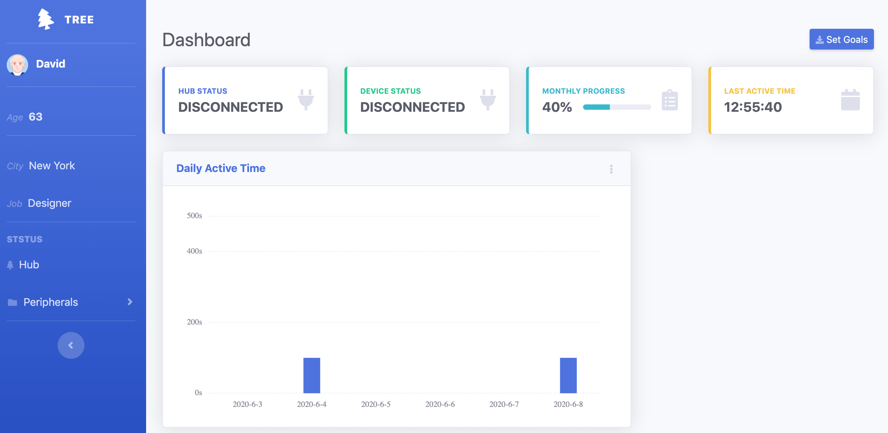

# TREE - Dashboard

**Tree-Dashboard** is a web-based user interface for stroke patients and their physical therapists.

The **front-end** design is derived from [SB Admin 2](https://startbootstrap.com/themes/sb-admin-2), an open-source theme for [Bootstrap](https://startbootstrap.com/).

The **back-end** service is based on Node.js and with the support of the Webscocket protocol and Redis database.

## Preview

## Download and Installation

To begin with this demo,please install [Redis database](redis.io) first and clone this repo.

## Usage

### Front-end

After installation, run `npm install` and then run `npm start` which will open up a preview of the dashboard in your default browser, watch for changes to core template files, and live reload the browser when changes are saved. You can view the `gulpfile.js` to see which tasks are included with the dev environment.
### Back-end

Run `npm run server` to start back-end service.

> After the installation, please copy `.env.example` file to a new file named `.env`. You can configure service port and SYNC_BROWSER port in `.env` file. The default port is `8000` for the service and `1234` for SYNC_BROWSER.

### Gulp Tasks

-   `gulp` the default task that builds everything
-   `gulp watch` browserSync opens the project in your default browser and live reloads when changes are made
-   `gulp css` compiles SCSS files into CSS and minifies the compiled CSS
-   `gulp js` minifies the themes JS file
-   `gulp vendor` copies dependencies from node_modules to the vendor directory

You must have npm installed globally in order to use this build environment. This theme was built using node v11.6.0 and the Gulp CLI v2.0.1. If Gulp is not running properly after running `npm install`, you may need to update node and/or the Gulp CLI locally.

## Route

- API
  > All APIs start with the prefix `/api` and it will be omitted for routes below. For example,`/hubinfo` stands for `HOST_NAME/api/hubinfo`.
  - `/hubinfo` **POST**
  The heartbeat of the hub will be sent to this route in a fixed time interval to acknowledge its connection status. And the current progress will be sent back as the response
  - `/deviceinfo` **POST**
  Heartbeat of an accessory
  - `/record` **GET**
  Retrieving all exercise records stored in database
  - `/record` **POST**
  Uploading a record to the server
  - `/config` **POST**
  Posting a specific JSON to this route will perform either detaching the latest record or deleting all records
  - `/goal` **POST**
  Uploading the customized exercise plan to the server

## Built with
- Express.js - A web framework 
- Vanilla.js - Single-page Application Router
- Handlebars - A simple templating language
- Socket.io - A fast and reliable real-time communication engine
